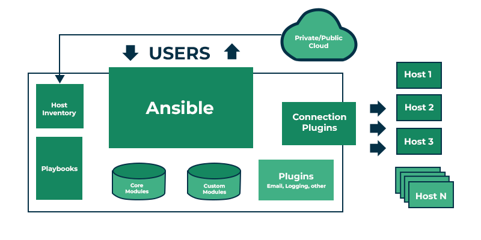

Ansible Architecture:
---------------------


Ansible installation:
---------------------
For ubuntu:

```bash
apt-get update
apt-get install ansible-core
```
verify installation:

`ansible --version`

Setup inventory:
----------------

Create directory:
```bash
mkdir -p /etc/ansible/inventory
```
Create inventory file:
nano /etc/ansible/inventory/hosts.ini
```yaml
[web]
10.10.110.24

[diff_ssh_port]
#server12 ansible_host=10.10.110.12 ansible_user=root ansible_port=2222
```

Verify inventory:
```
ansible-inventory -i /etc/ansible/inventory/hosts --list
```

Ping group in your inventory:
```
ansible web -m ping -i /etc/ansible/inventory/hosts
```

How to set public key authentication ?

Basics of Yaml:
--------------
YAML - Human readable language mostly used for writing configuration files.

Key-Value pairs:
```yaml
vars:
  username: dev_user
  server: 127.0.0.1
```

Lists:
```yaml
packages:
  - nginx
  - git
  - curl
```
Dictionaries (Nested Key-value):
```yaml
vars:
  user_info:
    name: devuser
    shell: /bin/bash
```

Creating Playbook:
------------------
Ansible playbook Syntax:
```
- name: My first play
  hosts: myhosts
  tasks:
   - name: Ping my hosts
     ansible.builtin.ping:

   - name: Print message
     ansible.builtin.debug:
       msg: Hello world
```

Task 1: Install packages:
install_package.yaml
```yaml
- name: install nginx on servers
  hosts: all

  tasks:
  - name: Install nginx
    apt:
      name: nginx
      state: present

```
Apply:
```
ansible-playbook install_package.yaml -i /etc/ansible/hosts
```

It failed!!! Due to connection with the host.
10.10.20.104               : ok=0    changed=0    unreachable=1    failed=0    skipped=0    rescued=0    ignored=0

Task 2: Create directory

create_directory.yaml
```yaml
---
- name: Create directory on remote hosts
  hosts: all
  become: true      ## Run as sudo/root

  tasks:
    - name: Ensure directory exists
      file:
        path: "/tmp/mydir"
        state: directory
        mode: '0755'
```
Run playbook for apply changes:

```
ansible-playbook create_directory.yaml -i /etc/ansible/inventory/hosts
```

Managing Tasks using Tags and Variables:
--------------

#### Tags:

task_tag.yaml
```yaml
tasks:
  - name: Install nginx
    apt:
      name: nginx
      state: present
    tags: install

  - name: Start nginx
    service:
      name: nginx
      state: started
    tags: start
```

How to use:
```
ansible-playbook create_directory.yaml -i /etc/ansible/inventory/hosts --tags start
```
#### Variables:

##### 1. Static:
create_directory.yaml
```yaml
---
- name: Create directory on remote hosts
  hosts: all
  become: true      ## Run as sudo/root

  vars:
    dir_path: 

  tasks:
    - name: Ensure directory exists
      file:
        path: "{{ dir_path }}"
        state: directory
        mode: '0755'
```
Run playbook for apply changes:

```
ansible-playbook create_directory.yaml -i /etc/ansible/inventory/hosts
```
##### 2. Parameterized:
Dynamic-value.yaml
```yaml
---
- name: Create directory on remote hosts
  hosts: all
  become: true  

  vars:
    dir_path: /tmp/{{VAR}}

  tasks:
    - name: Ensure directory exists
      file:
        path: "{{ dir_path }}"
        state: directory
        mode: '0755'
```
Run playbook
```
ansible-playbook create_directory.yaml -i /etc/ansible/inventory/hosts --extra-vars "VAR=hello"
```
Breaking Playbook into Roles:
------------------------------
What is Roles ?
- Way to Organize and re-use the automation code.
- Like, Breaking tasks into smaller parts.

How to create:
```
ansible-galaxy init nginx-role
```

Directory structure:
```
roles/
site.yaml
└── nginx-role/
    ├── tasks/
    │   └── main.yml       ← list of tasks to do
    ├── files/             ← files to copy
    ├── templates/         ← config templates
    ├── vars/              ← default variables
    └── handlers/          ← restart service if needed
```

Let's see it step-by-step:

tasks: contains the tasks.

roles/nginx/tasks/main.yml
```
- name: Install NGINX
  apt:
    name: nginx
    state: present
    update_cache: yes

- name: Copy NGINX config
  template:
    src: nginx.conf.j2
    dest: /etc/nginx/nginx.conf
  notify: restart nginx

- name: Ensure NGINX is running
  service:
    name: nginx
    state: started
    enabled: yes
```
Template: service configuration files. if any

roles/nginx/templates/nginx.conf.j2
```
user www-data;
worker_processes auto;
pid /run/nginx.pid;
events { worker_connections 768; }

http {
    server {
        listen 80;
        location / {
            return 200 'Hello from Ansible-managed NGINX!';
        }
    }
}

```
Handlers: This is use for Handeling the service.

roles/nginx/handlers/main.yml
```
- name: restart nginx
  service:
    name: nginx
    state: restarted
```

defaults: if any variables are there.

roles/nginx/defaults/main.yml

Main file:

site.yaml

```
- name: Install and configure NGINX
  hosts: web
  become: yes
  roles:
    - nginx-role
```

Execute playbook:
```
ansible-playbook site.yaml -i /etc/ansible/inventory/hosts
```

Control Structures:
----------
### Blocks, Loops, Conditions

#### Blocks
Group Multiple related tasks together.

blocks.yaml
```yaml
- name: Nginx
  hosts: all
  become: true      ## Run as sudo/root

  tasks:
  - block:
      - name: Install NGINX
        apt:
          name: nginx
          state: present

      - name: Start NGINX
        service:
          name: nginx
          state: started
    name: Setup web server
```
#### loops
Perform multiple tasks in loop.

For example installing multiple packages
loop.yaml
```yaml
- name: Nginx
  hosts: all
  become: true      ## Run as sudo/root

  tasks:
  - name: Install multiple packages
    apt:
      name: "{{ item }}"
      state: present
    loop:
      - git
      - curl
      - unzip

```
